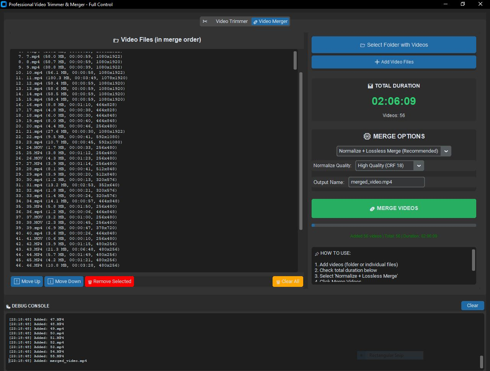
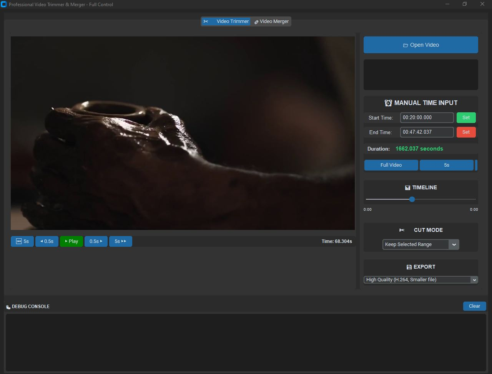

# 🎬 SOLOHASH Video Tool

### Professional Video Trimmer & Merger

**Trim and merge videos effortlessly with this powerful desktop application**

[⬇️ Download Now](https://github.com/MJsolohash/SOLOHASH-VideoTool/releases/latest) 
[📖 Documentation](#-features) 
[💬 Report Issue](https://github.com/MJsolohash/SOLOHASH-VideoTool/issues)

---

## ✨ Features

| Feature | Description |
|---------|-------------|
| ✂️ **Video Trimmer** | Cut videos with frame-perfect accuracy |
| 🔗 **Video Merger** | Merge multiple videos (different formats supported) |
| ⚡ **Fast Processing** | Lossless merge when formats match |
| 🎨 **Modern UI** | Dark theme with CustomTkinter |
| 📊 **Total Duration** | See total time before merging |
| 🐛 **Debug Console** | Real-time progress and error logs |
| 💾 **Quality Presets** | High, Medium, Low, or Lossless |
| 🚀 **Portable** | No installation required (portable version available) |

---

## 📸 Screenshots

| Trimmer Tab | Merger Tab |
|:---:|:---:|
|  |  |

---

## 🚀 Quick Download

### Direct Download Links

| Version | Download | Size |
|---------|----------|------|
| **Installer** (Recommended) | [VideoTool_Setup.exe](https://github.com/MJsolohash/SOLOHASH-VideoTool/releases/latest) | ~150 MB |
| **Portable** (No install) | [VideoTool_Portable.zip](https://github.com/MJsolohash/SOLOHASH-VideoTool/releases/latest) | ~150 MB |

### System Requirements

| Requirement | Minimum |
|-------------|---------|
| OS | Windows 10 / 11 (64-bit) |
| RAM | 4 GB |
| Disk Space | 200 MB |
| CPU | Any modern processor |

---

## 📥 Installation Guide

### Option 1: Installer (Recommended)

1. Download `VideoTool_Setup.exe` from the links above
2. Double-click the downloaded file to run
3. Choose your installation location (default: `C:\Program Files\VideoTool`)
4. Click "Install" and wait for completion
5. Launch from Start Menu or Desktop shortcut

### Option 2: Portable Version (No Installation)

1. Download `VideoTool_Portable.zip`
2. Extract the zip file to any folder
3. Run `VideoTool.exe` from the extracted folder

> **📌 Note:** No Python or FFmpeg installation required! Everything is bundled in the package.

---

## 🎮 How to Use

### Merging Videos (Combine multiple videos into one)

1. **Open Video Tool**
2. **Click on "Video Merger" tab**
3. **Click "Select Folder"** (to add all videos from a folder) OR click **"Add Video Files"** (to select specific files)
4. **Check the total duration** displayed on the right side
5. **From "MERGE OPTIONS"**, select "Normalize + Lossless Merge"
6. **Click the "MERGE VIDEOS" button**
7. **Wait for the process to complete**
8. **Find your merged video** in the same folder as originals ✓

### Trimming Videos (Cut specific parts from a video)

1. **Open Video Tool**
2. **Click on "Video Trimmer" tab**
3. **Click "Open Video"** and select your video file
4. **Set Start Time** (when to begin cutting)
5. **Set End Time** (when to stop cutting)
6. **Choose your preferred quality preset**
7. **Click "EXPORT VIDEO"**
8. **Choose save location** and wait ✓

### Using the Timeline Slider

- Drag the slider to quickly navigate through the video
- Use the preview buttons for fine adjustments:
  - `⏮️ 5s` - Jump back 5 seconds
  - `◀ 0.5s` - Jump back half a second
  - `▶ Play` - Play/Pause video preview
  - `0.5s ▶` - Jump forward half a second
  - `5s ▶▶` - Jump forward 5 seconds

### Merge Methods Explained

| Method | Best For | Speed | Quality |
|--------|----------|-------|---------|
| **Normalize + Lossless** | Different format videos | Medium | High |
| **Direct Lossless** | Same format videos | Very Fast | Perfect |
| **Re-encode** | When others fail | Slow | Medium |

---

## ❓ Frequently Asked Questions (FAQ)

### Q: Do I need to install Python?
**A:** NO! Everything is bundled in the installer. Just download and run.

### Q: Do I need to install FFmpeg?
**A:** NO! FFmpeg is included in the package.

### Q: Can I merge videos with different resolutions?
**A:** YES! The app automatically normalizes formats while keeping original resolution.

### Q: Is there any quality loss?
**A:** 
- **Normalize + Lossless Merge**: Minimal loss (one-time during normalization)
- **Direct Lossless Merge**: No quality loss (only works if formats match)
- **Re-encode Merge**: Some quality loss (use as fallback only)

### Q: How long does merging take?
**A:** 
- 10 videos (~5 minutes total): 30-60 seconds
- 50 videos (~1 hour total): 5-10 minutes
- 100 videos (~2 hours total): 10-20 minutes

### Q: Can I cancel during merge?
**A:** Yes, just close the application. Temporary files will be cleaned up automatically.

### Q: Where are my converted files saved?
**A:** In a `converted` folder next to your original videos. After merge completes, you'll be asked whether to keep or delete them.

### Q: Why is my output video duration wrong?
**A:** Use the "Normalize + Lossless Merge" method. This normalizes all videos to the same format before merging.

### Q: The app shows "FFmpeg not found" error?
**A:** Make sure the `bin` folder with `ffmpeg.exe` and `ffprobe.exe` is in the same directory as `VideoTool.exe`.

### Q: Can I use this on Windows 7?
**A:** Windows 10 or 11 is recommended. Windows 7 may work but is not officially tested.

### Q: Is this really free?
**A:** YES! Completely free for personal and commercial use.

---

## 🔧 Troubleshooting Guide

| Problem | Solution |
|---------|----------|
| App won't start | Right-click and select "Run as Administrator" |
| Merge fails | Try the "Re-encode Merge" method instead |
| Duration mismatch | Use "Normalize + Lossless Merge" method |
| FFmpeg error | Ensure bin folder has ffmpeg.exe and ffprobe.exe |
| Out of memory | Close other applications and try again |
| Slow processing | Use lower quality preset (Medium or Low) |
| File not found | Check if video files still exist in the original location |
| Permission denied | Run the application as Administrator |

---

## 📊 Performance Benchmarks

| Action | 10 Videos (5 min) | 50 Videos (1 hour) | 100 Videos (2 hours) |
|--------|-------------------|---------------------|----------------------|
| Normalize + Lossless | ~2 min | ~15 min | ~30 min |
| Direct Lossless | ~30 sec | ~5 min | ~10 min |
| Re-encode | ~5 min | ~45 min | ~90 min |

*Tested on: Intel i7, 16GB RAM, SSD storage*

---

## 🛠️ Built With

| Technology | Version | Purpose |
|------------|---------|---------|
| Python | 3.13 | Core programming language |
| CustomTkinter | 5.2.0 | Modern GUI framework |
| FFmpeg | 8.0 | Video processing engine |
| OpenCV | 4.10.0 | Frame extraction and preview |
| PyInstaller | 6.19.0 | EXE packaging |
| Inno Setup | 6.0 | Installer creation |

---

## 📝 Changelog

### v1.0.0 (2026-04-21) - Initial Release

**Added Features:**
- ✅ Video trimming with frame-accurate precision
- ✅ Real-time video preview during trimming
- ✅ Manual time input (HH:MM:SS format)
- ✅ Multiple cut modes (Keep/Remove selected range)
- ✅ Video merging with format normalization
- ✅ 3 merge methods (Normalize+Lossless, Direct Lossless, Re-encode)
- ✅ Total duration calculator before merging
- ✅ Debug console for real-time progress
- ✅ Quality presets (High, Medium, Low, Perfect)
- ✅ Keep original resolution option
- ✅ Converted files management (keep/delete)
- ✅ Dark theme modern UI
- ✅ Progress bars for all operations
- ✅ Move Up/Down to reorder merge list
- ✅ Support for multiple video formats (.mp4, .MP4, .MOV, .mkv, .avi)

**Known Issues:**
- None reported yet

---

## 🗺️ Roadmap (Future Updates)

### v1.1.0 (Coming Soon)
- [ ] Support for more video formats
- [ ] Batch processing mode
- [ ] Keyboard shortcuts
- [ ] Custom output folder selection
- [ ] Progress percentage display

### v1.2.0 (Planned)
- [ ] Video compression feature
- [ ] Extract audio from video
- [ ] Add watermark option
- [ ] Speed up/slow down video
- [ ] Rotate video option

### v1.3.0 (Future)
- [ ] GPU acceleration support
- [ ] Command line interface
- [ ] Preset profiles
- [ ] Multi-language support

---

## 👨‍💻 Developer

**Created with ❤️ by SOLOHASH**

---

## 🤝 Contributing

Contributions are welcome! If you'd like to contribute:

1. Fork the repository
2. Create a feature branch (`git checkout -b feature/AmazingFeature`)
3. Commit your changes (`git commit -m 'Add some AmazingFeature'`)
4. Push to the branch (`git push origin feature/AmazingFeature`)
5. Open a Pull Request

---

## 📜 License

This project is licensed under the MIT License - see the [LICENSE](LICENSE) file for details.

**You are free to:**
- ✅ Use this software commercially
- ✅ Modify and adapt the code
- ✅ Distribute copies
- ✅ Use privately

**Under these conditions:**
- 📌 Include copyright notice
- 📌 Include license in distributions

---

## 🙏 Acknowledgments

- **FFmpeg team** - For their incredible video processing library
- **CustomTkinter developers** - For the modern UI framework
- **OpenCV community** - For computer vision tools
- **PyInstaller team** - For making standalone executables possible
- **Inno Setup team** - For the installer creator

---

## 📞 Support

| Channel | Link |
|---------|------|
| Report Issues | [GitHub Issues](https://github.com/MJsolohash/SOLOHASH-VideoTool/issues) |
| Feature Requests | [GitHub Issues](https://github.com/MJsolohash/SOLOHASH-VideoTool/issues) |
| GitHub | [@MJsolohash](https://github.com/MJsolohash) |

---

## ⭐ Star History

If you find this tool useful, please consider giving it a star on GitHub! It helps others discover the project.

---

**Made with ❤️ in Sri Lanka**

[⬆ Back to Top](#-solohash-video-tool)

